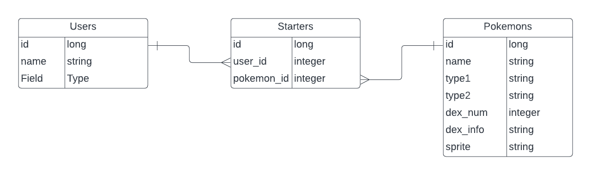

#Pokemon Starter Selector and Pokedex
This is a Ruby with React.js application that allows users to select viewing the pokedex or selecting their starter. The pokedex is a small library of pokemon with their name, pokedex number, type and pokedex information. The starter selector allows you to create your own user followed by selecting your starter and giving it a nickname. You have the choice to review your starter, update their name or delete them.

##Technology
Built with React.js, JSX, CSS, Ruby, ActiveRecord, Sinatra, Gem, and Node.js

##Requirements
Ruby and npm

##Install

Steps:

###1: Fork and Clone this repo to your local device. Open the folder in two seperate terminals to run the front and backend. To run the backend, you need to be in the main folder and run bundle install first. For the front end, in your second terminal, cd into the client folder from the main folder. Once you are in the client folder, run npm install. 

###2. After running the installs, in the terminal that you ran bundle install, now run bundle exec rake server to run the backend server. From here, go to your terminal that is in the client folder and run npm start to run the front end, as well as, open a window on your browser to localhost:3000

###3. Feel Free to explore the site! This is a single page application that uses several react components and full CRUD.
        *The first page will give you the option to select going to the pokedex or choosing your starter
        *The pokedex selection will take you to a small library of pokemon to review their name, typing and pokedex information
        *The starter selector will take you through several steps.
              ***the first part is to create your own user
              ***the second part is selecting your user, choosing your starter and nicknaming your starter
              ***the final part allows you to select your name to review your starter selections, update their nicknames or delete the starter

###Note
All images and pokemon names used in this program are part of the pokemon company. Images used are from a pokemon wikipedia called Bulbapedia.

###ERD - Entity Relationship Diagram
